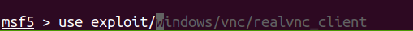
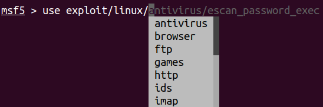
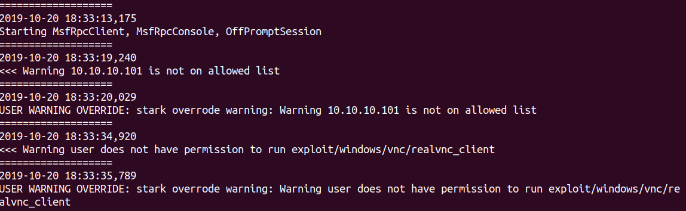
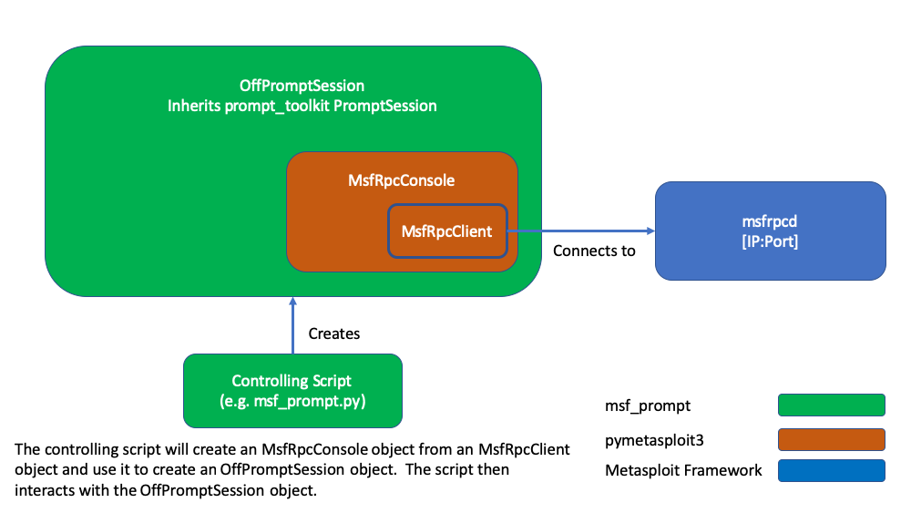

# msf_prompt

msf_prompt is a Python library that emulates the msfconsole by wrapping a pymetasploit3 MsfRpcConsole in a prompt_toolkit PromptSession.  The goal is to make msfconsole easier for beginners to use and more convenient for experienced professionals. 

pymetasploit3: (https://github.com/DanMcInerney/pymetasploit3)

prompt_toolkit: (https://github.com/prompt-toolkit/python-prompt-toolkit)


## Primary Features Include:
- Not Ruby
- Auto-suggest completion based on history, word-list, msf tab-completes
  - 
- Smarter tab-completion
  - 
- Ability to control which modules a user can run
- Ability to restrict RHOSTS to white-listed IPs
- Ability to allow/disallow users from overriding module/IP warnings
- Increased Logging
  - 

- Not Ruby

## Installation

WARNING: ipython does not play nicely with prompt_toolkit 2.0.  It's recommended to run this in a pyenv or separate vm if you care about ipython

Tested from a clean install of Ubuntu 18.04:
```bash
sudo apt-get install python3
sudo apt-get install python3-pip
pip3 install setuptools
sudo apt-get install git
git clone https://github.com/starksimilarity/msf_prompt.git
cd msf_prompt
sudo python3 setup.py install
```

## Usage

Stand-alone
```bash
> python3 msf_prompt.py
```

As a module
```python
import offpromptsession 
import pymetasploit3


client = pymetasploit3.msfrpc.MsfRpcClient()
console = pymetasploit3.msfconsole.MsfRpcConsole(client)
sess = offpromptsession.OffPromptSession(console)

sess.prompt() #interact
```

To modify users/targets
```bash
> python3 usr_tgt_mod.py
```


## Module Interactions


## License
[GNU GPLv3](https://www.gnu.org/licenses/gpl-3.0.en.html)
