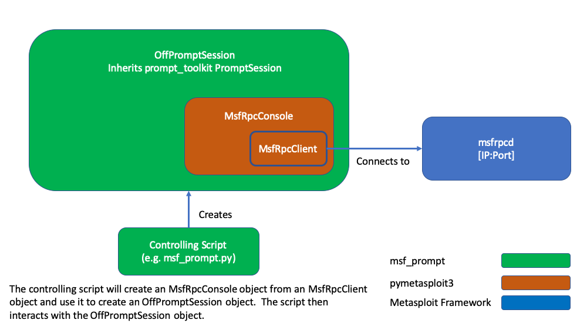

# msf_prompt

msf_prompt is a Python library that emulates the msfconsole by wrapping a pymetasploit3 MsfRpcConsole in a prompt_toolkit PromptSession

## Installation

## Usage

Stand-alone
```bash
> python msf_prompt.py
```

As a module
```python
import offpromptsession 
import pymetasploit3


client = pymetasploit3.msfrpc.MsfRpcClient()
console = pymetasploit3.msfconsole.MsfRpcConsole(client)
sess = offpromptsession.OffPromptSession(console)

sess.prompt() #interact
```


## Module Interactions


## License
[GNU GPLv3](https://www.gnu.org/licenses/gpl-3.0.en.html)
